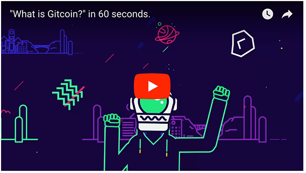

<table>
<td width=100>

</td>
<td width=800>
Gitcoin is a constellation of Ethereum-based smart contracts designed to Push Open Source Forward. Learn more at https://gitcoin.co
</td>
</table>

[Star](https://github.com/gitcoinco/gitcoinco/stargazers) and [watch](https://github.com/gitcoinco/gitcoinco/watchers) this github repository to stay up to date, we're pushing new code several times per week!

# Why cryptocurrency

Cryptocurrency allows end-users to send tips and issue funding for Github Issues without 

* bureacracy
* trusted intermediaries
* international payment fees
* credit card fees

[More about how/why cryptocurrency here](https://github.com/gitcoinco/gitcoinco/issues/4)

# What is Gitcoin?

Gitcoin is an open source distributed network that makes it easy to monetize your work in open source software.

## Network Values, Mission, and Culture

Read about our culture and mission at https://github.com/gitcoinco/gitcoinco/issues/6 

## Features

_A tip_ is a tool to send ether or any ethereum token to any github account. The flow for tips looks like this:

> Send (party 1) => receive (party 2)

_Funded Issues_ are a way to fund open source features, bugs, or security bounties. The flow for funded issues looks like this:

> Fund Issue (party 1) => claim funds (party 2) => accept (party 1)

## What kinds of issues make great funded issues? 

Gitcoin supports bug, feature, and security funded issues.  Any issue that you need done is a good candidate for a funded issue, provided that:

* It’s open today.
* The repo README clearly enumerates how a new developer should get set up to contribute.
* The task is well defined.
* The end-state of the task is well defined.
* The pricing of the task reflects (market rate * complexity) of the task.
* The issue is on the roadmap, but does not block other work.

To get started with funded issues today, it might be good to start small.  Is there a small bug that needs fixed?  An issue that’s been open for a while that no one is tackling?  An administrative task?

Post your issue on the [Issue Explorer](https://gitcoin.co/explorer).

# Project Repos

* [web](https://github.com/gitcoinco/web) - This is the website that is live at gitcoin.co
* [smart_contracts](https://github.com/gitcoinco/smart_contracts) - Where funded issues are stored and indexed.
* [chrome_ext](https://github.com/gitcoinco/chrome_ext) - The google chrome extension for browsing bounties natively on github.com
* [ios](https://github.com/gitcoinco/ios) - An iOS app for browsing Funded Issues.

# Getting Started

Check out the developer guide at [https://gitcoin.co/help/dev](https://gitcoin.co/help/dev).

Check out the repo maintainer guide at [https://gitcoin.co/help/repo](https://gitcoin.co/help/repo).

## Dogfood Gitcoin

Here's a list of active Funded Issues that were made for building gitcoinco.

# About the team

<table>
<td width=200>

</td>
<td width=800>
<a href="https://twitter.com/owocki">Kevin Owocki</a> has a BS in Computer Science, 15 years experience in Open Source Software and Technology Startups. He is a volunteer in the Boulder Community for several community organizations, and an avid open source developer. His work has been featured in <a href="http://techcrunch.com/2011/02/10/group-dating-startup-ignighter-raises-3-million/" >TechCrunch</a>, <a href="http://www.cnn.com/2011/BUSINESS/03/29/india.online.matchmaking/" >CNN</a>, <a href="http://www.inc.com/30under30/2011/profile-adam-sachs-kevin-owocki-and-dan-osit-founders-ignighter.html" >Inc Magazine</a>, <a href="http://www.nytimes.com/2011/02/20/business/20ignite.html?_r=4&amp;amp;pagewanted=1&amp;amp;ref=business"  >The New York Times</a>, <a href="http://boingboing.net/2011/09/24/tosamend-turn-all-online-i-agree-buttons-into-negotiations.html" >BoingBoing</a>, <a href="http://www.wired.com/2015/12/kevin-owocki-adblock-to-bitcoin/"  >WIRED</a>, <a href="https://www.forbes.com/sites/amycastor/2017/08/31/toothpick-takes-top-prize-in-silicon-beach-ethereum-hackathon/#6bf23b7452ad" >Forbes</a>, and <a href="http://www.techdigest.tv/2007/08/super_mario_get_1.html" >TechDigest</a>.
</td>
</table>

Also, we are [hiring](https://gitcoin.co/about#jobs)!

